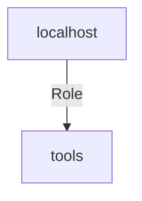

<!-- DOCSIBLE START -->

# 📃 Role overview

## tools

```
Role belongs to lpi_code/tools_deploy
Namespace - lpi_code
Collection - tools_deploy
Version - 0.1.0
Repository - https://www.github.com/lpi-code/lpi-code.tools_deploy
```

Description: your role description


| Field                | Value           |
|--------------------- |-----------------|
| Readme update        | 10/09/2024 |


### Defaults

**These are static variables with lower priority**

#### File: defaults/main.yml

| Var          | Type         | Value       |Required    | Title       |
|--------------|--------------|-------------|-------------|-------------|
| [tools_packages](defaults/main.yml#L3)   | list   | `['zsh']`  |  n/a  |  n/a |


### Tasks


#### File: tasks/main.yml

| Name | Module | Has Conditions |
| ---- | ------ | --------- |
| Install packages | ansible.builtin.package | False |


## Playbook

```yml
---
- hosts: localhost
  remote_user: root
  roles:
    - tools

```
## Playbook graph


## Author Information
your name

#### License

license (GPL-2.0-or-later, MIT, etc)

#### Minimum Ansible Version

2.1

#### Platforms

No platforms specified.
<!-- DOCSIBLE END -->